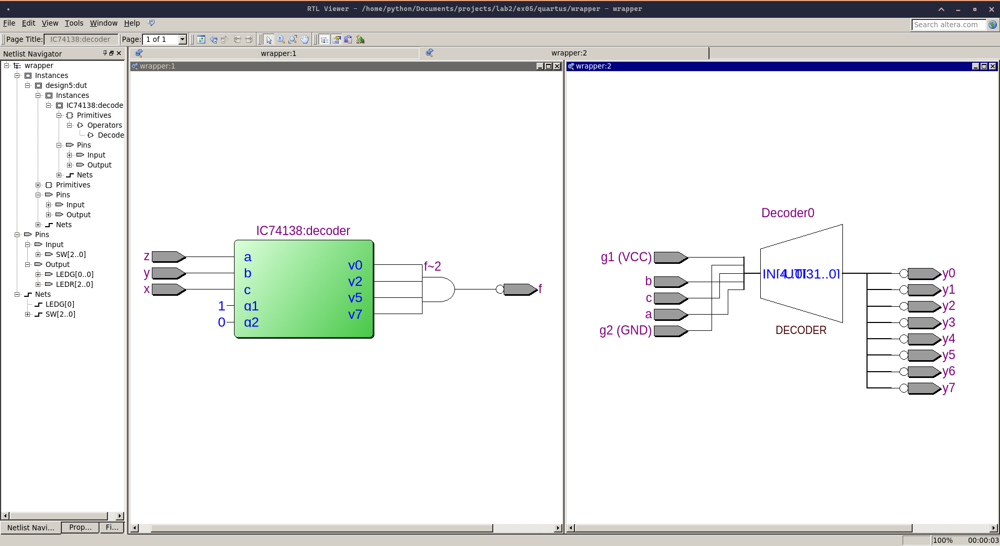
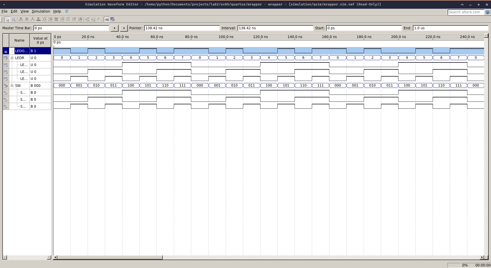

#### Source code included:
- [IC74138.sv](./IC74138.sv)
- [design5.sv](./design5.sv)
- [wrapper.sv](./quartus/wrapper.sv) for quartus (in folder "quartus")

#### RTL viewer result

#### Simulation result

